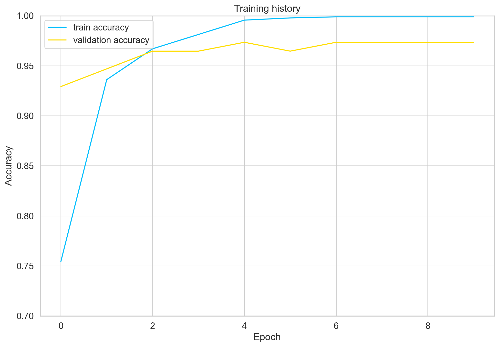
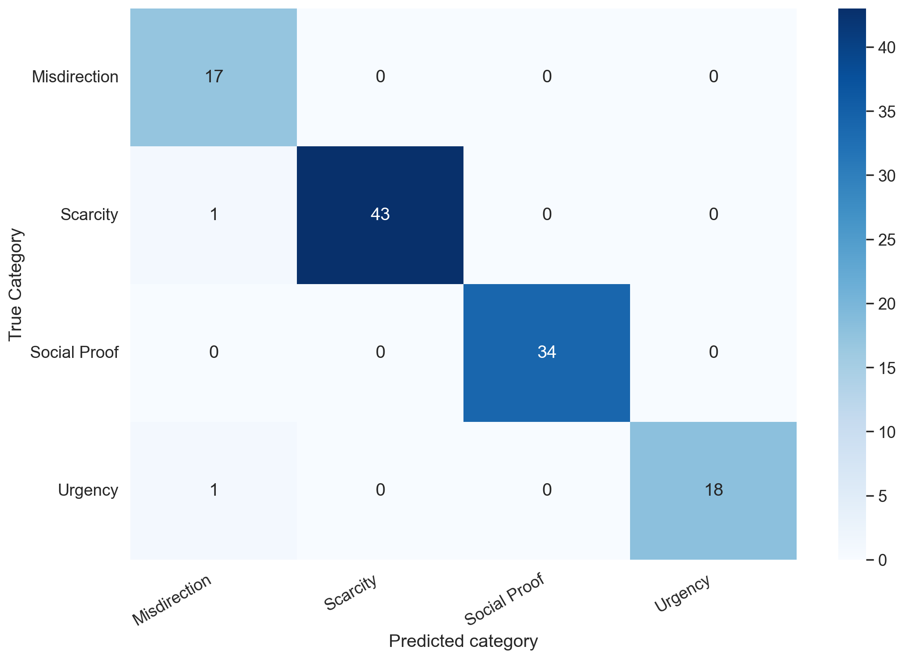
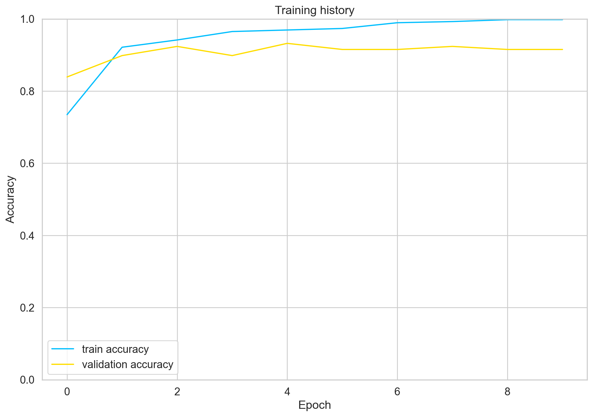
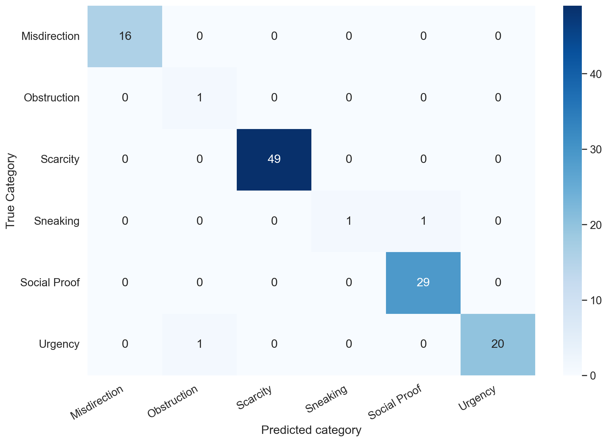
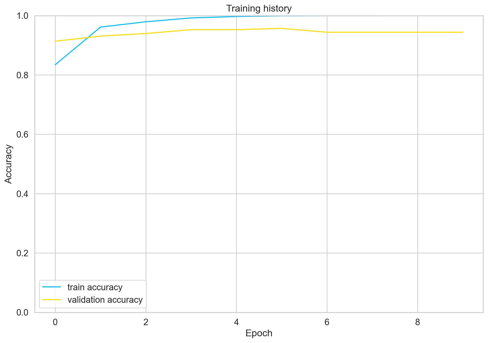
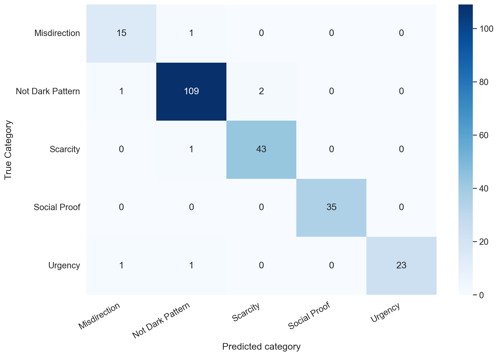

> The pre-trained Dark Pattern Spotter's model was used to fine tune this model.

# Pre-trained Model for 4 Category Classification 

## Specifications
- Model = `bert-base-cased`
- Learning Rate = `5e-5`
- Batch size = `32`
- Dropout = `0.1`
- Epochs = `10`

## Training Results

## Classification Report
|              | precision | recall | f1-score | support |
|--------------|-----------|--------|----------|---------|
| Misdirection |      0.89 |   1.00 |     0.94 |      17 |
| Scarcity     |      1.00 |   0.98 |     0.99 |      44 |
| Social Proof |      1.00 |   1.00 |     1.00 |      34 |
| Urgency      |      1.00 |   0.95 |     0.97 |      19 |
|              |           |        |          |         |
|     accuracy |           |        |     0.98 |     114 |
|    macro avg |      0.97 |   0.98 |     0.98 |     114 |
| weighted avg |      0.98 |   0.98 |     0.98 |     114 |

### Accuracy achieved = `0.9824`

## Confusion Matrix

---

# Pre-trained Model for 6 Category Classification

## Specifications
- Model = `bert-base-cased`
- Learning Rate = `5e-5`
- Batch size = `32`
- Dropout = `0.1`
- Epochs = `10`

## Training Results

## Classification Report
|              | precision | recall | f1-score | support |
|--------------|-----------|--------|----------|---------|
| Misdirection |       1.00|   1.00 |     1.00 |      16 |
|  Obstruction |       0.50|   1.00 |     0.67 |       1 |
|     Scarcity |       1.00|   1.00 |     1.00 |      49 |
|     Sneaking |       1.00|   0.50 |     0.67 |       2 |
| Social Proof |       0.97|   1.00 |     0.98 |      29 |
|      Urgency |       1.00|   0.95 |     0.98 |      21 |
|              |           |        |          |         |  
|     accuracy |           |        |     0.98 |     118 |
|    macro avg |       0.91|   0.91 |     0.88 |     118 |
| weighted avg |       0.99|   0.98 |     0.98 |     118 |

### Accuracy achieved = `0.9830`

## Confusion Matrix

---

# Pre-trained Model for 4 Categories + Non-Dark Pattern Classification

## Specifications
- Model = `bert-base-cased`
- Learning Rate = `3e-5`
- Batch size = `32`
- Dropout = `0.1`
- Epochs = `10`

## Training Results

|                  | precision | recall | f1-score | support |
|------------------|-----------|--------|----------|---------|
|    Misdirection  |      0.88 |   0.94 |     0.91 |      16 |
| Not Dark Pattern |      0.97 |   0.97 |     0.97 |     112 |
|        Scarcity  |      0.96 |   0.98 |     0.97 |      44 |
|    Social Proof  |      1.00 |   1.00 |     1.00 |      35 |
|         Urgency  |      1.00 |   0.92 |     0.96 |      25 |
|                  |           |        |          |         |   
|        accuracy  |           |        |     0.97 |     232 |
|       macro avg  |      0.96 |   0.96 |     0.96 |     232 |
|    weighted avg  |      0.97 |   0.97 |     0.97 |     232 |

### Accuracy achieved = `0.9698`

## Confusion Matrix
